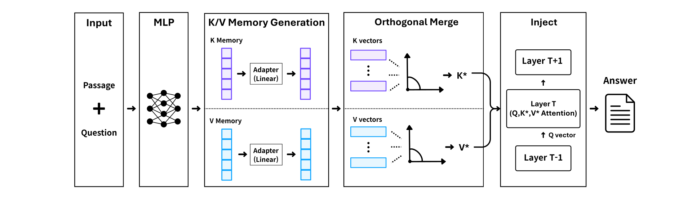
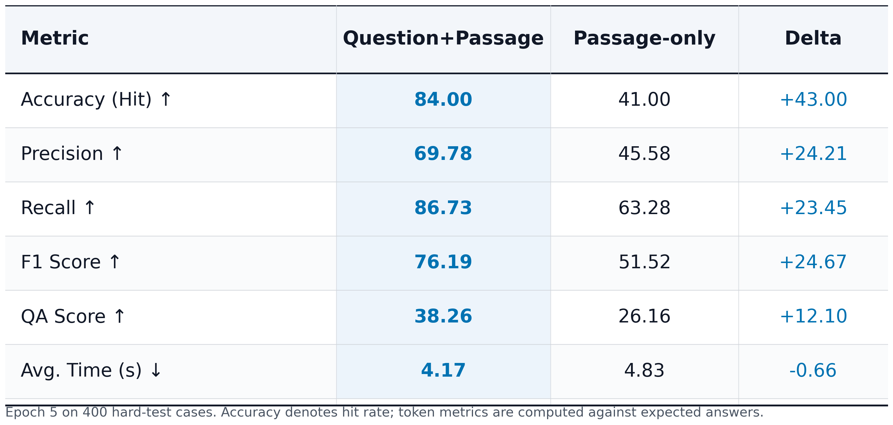
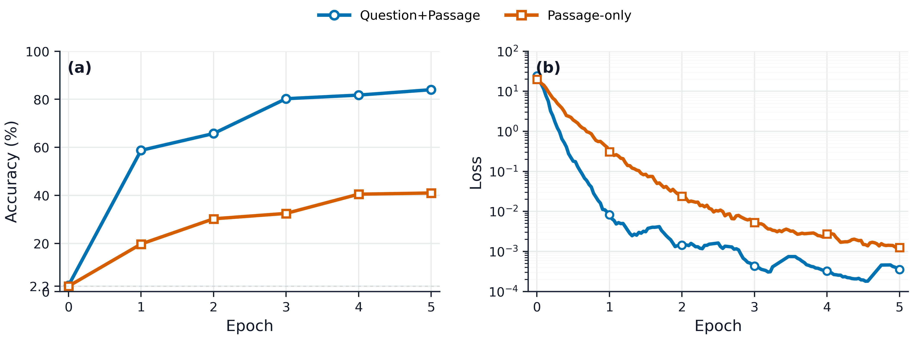

# BridgePRAG

**FiD-inspired question-conditioned HyperKV memory for decoder-only Retrieval-Augmented Generation.**

[](https://www.python.org/)
[](https://pytorch.org/)
[](https://huggingface.co/docs/transformers)
[](LICENSE)
[](#research-status)

BridgePRAG is a compact research codebase for encoding retrieved evidence into
learned **K/V memory slots** and injecting them into a frozen decoder-only LLM.
It starts from the MergePRAG/HyperKV direction, then changes the memory encoder
with a Fusion-in-Decoder-style question-passage boundary and a lightweight
linear **KV adapter** for calibration.

<div align="center">
  
  <br>
  <sub><b>Figure 1.</b> FiD-style question-passage encoding generates calibrated K/V memory slots for decoder-only RAG.</sub>
</div>

## Why BridgePRAG?

- **Question-conditioned memory**: encode `question + passage` before generating HyperKV slots.
- **FiD-inspired boundary**: move from passage-only memory toward query-aware evidence encoding.
- **KV adapter correction**: learn linear residual corrections for generated key/value slots.
- **Decoder-only compatible**: inject memory through a selected transformer layer without fine-tuning the base LLM.
- **Reproducible research layout**: installable package, toy data, training CLI, inference CLI, tests, figures, citation file.

## Install

```bash
git clone https://github.com/SeungMin2001/BridgePRAG.git
cd BridgePRAG
python -m pip install -e ".[dev]"
```

For GPU runs, install the PyTorch build that matches your CUDA version first:

```bash
python -m pip install torch --index-url https://download.pytorch.org/whl/cu121
python -m pip install -e ".[dev]"
```

## Quickstart

Train a tiny BridgePRAG memory generator:

```bash
bridgeprag train \
  --data examples/data/tiny_memory.jsonl \
  --output runs/tiny_bridgeprag.pt \
  --model Qwen/Qwen2.5-0.5B \
  --num-kv 8 \
  --hidden-dim 512 \
  --critical-layer 8 \
  --epochs 1 \
  --max-steps 3
```

Run question-conditioned memory inference:

```bash
bridgeprag infer \
  --checkpoint runs/tiny_bridgeprag.pt \
  --question "What does the KV adapter correct?" \
  --passage "The KV adapter applies lightweight linear corrections to generated key and value slots."
```

Python API:

```python
from bridgeprag import BridgePRAG

bridge = BridgePRAG.from_checkpoint("runs/tiny_bridgeprag.pt")
answer = bridge.generate(
    question="What does the KV adapter correct?",
    passages=[
        "The KV adapter applies lightweight linear corrections to generated key and value slots."
    ],
)
print(answer)
```

## Method

BridgePRAG trains only a small HyperKV generator while the base LLM stays frozen.

1. Encode retrieved evidence as either `passage` or `question + passage`.
2. Project token features into slot-wise hidden states with attentive pooling.
3. Produce `K` and `V` memory slots.
4. Apply a linear KV adapter: `K = K + A_k(K)`, `V = V + A_v(V)`.
5. Inject memory into a selected decoder layer with cross-attention.
6. Merge multiple passages through orthogonal slot composition.

The main contrast is:

| Variant | Memory encoder input | Slot correction | Intended effect |
| --- | --- | --- | --- |
| Passage-only HyperKV | passage | none | compact external memory |
| BridgePRAG | question + passage | linear KV adapter | query-aware, calibrated memory |

See [docs/method.md](docs/method.md) for the full research note.

## Results Snapshot

The current BridgePRAG branch reports the following question+passage vs
passage-only memory comparison on an entity-style memory validation setup.

| Metric | Question+Passage | Passage-only | Delta |
| --- | ---: | ---: | ---: |
| Accuracy (Hit) | 84.00 | 41.00 | +43.00 |
| Precision | 69.78 | 45.58 | +24.21 |
| Recall | 86.73 | 63.28 | +23.45 |
| F1 Score | 76.19 | 51.52 | +24.67 |
| QA Score | 38.26 | 26.16 | +12.10 |
| Avg. Time (s) | 4.17 | 4.83 | -0.66 |

<div align="center">
  
  <br>
  <sub><b>Table 1.</b> Question-conditioned memory improves hit accuracy, F1, and QA score while reducing average latency.</sub>
</div>

<br>

<div align="center">
  
  <br>
  <sub><b>Figure 2.</b> Question-conditioned K/V memory reaches higher validation accuracy and converges faster than passage-only memory.</sub>
</div>

## Dataset Format

Minimal JSONL:

```json
{"source_id":"ex1","passage":"...","question":"...","answer":"...","full_answer":"..."}
```

Augmented rows may include `qas`, `atomic_qas`, `final_qas`, and
`hard_negatives`; the loader expands them into independent memory supervision
examples.

## Repository Layout

```text
bridgeprag/          # installable research package
  config.py          # BridgePRAGConfig
  memory.py          # HyperKV generator, FiD-style encoding, injection hooks
  runtime.py         # high-level BridgePRAG wrapper
  trainer.py         # compact frozen-LLM training loop
  cli.py             # bridgeprag train / infer
examples/            # tiny runnable examples
docs/                # method and reproduction notes
assets/              # architecture and experiment figures
tests/               # shape/data tests for fast CI
```

## Research Status

This repository is a research preview. The code is intended to make the
BridgePRAG mechanism easy to inspect, run, and adapt. Large checkpoints are not
stored in git; release checkpoints should be attached through GitHub Releases or
Hugging Face Hub.

## Roadmap

- [ ] Release a compact pretrained BridgePRAG checkpoint.
- [ ] Add a full benchmark script for passage-only vs question+passage memory.
- [ ] Add Hugging Face model card metadata for released checkpoints.
- [ ] Add an arXiv-style technical report.

## Citation

```bibtex
@software{bridgeprag2026,
  title = {BridgePRAG: FiD-Inspired Question-Conditioned HyperKV Memory for Decoder-Only RAG},
  author = {SeungMin2001},
  year = {2026},
  url = {https://github.com/SeungMin2001/BridgePRAG}
}
```

## References

- MergePRAG-style HyperKV memory for retrieval-augmented generation.
- Fusion-in-Decoder-style question-passage encoding for retrieved evidence.
- Decoder-only KV-cache and cross-attention memory injection.

## License

MIT. See [LICENSE](LICENSE).
